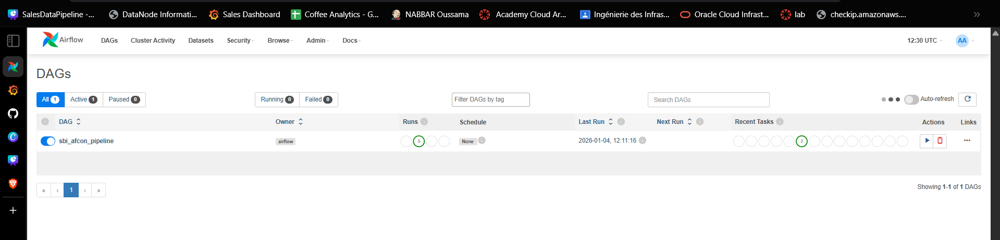
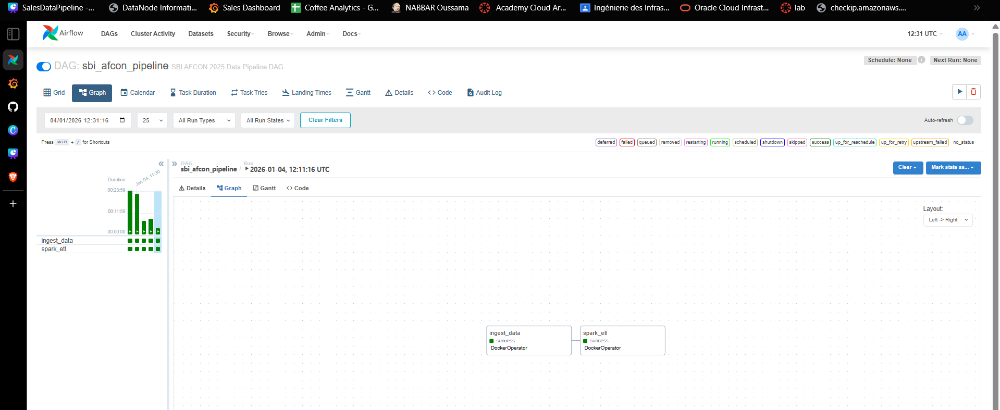
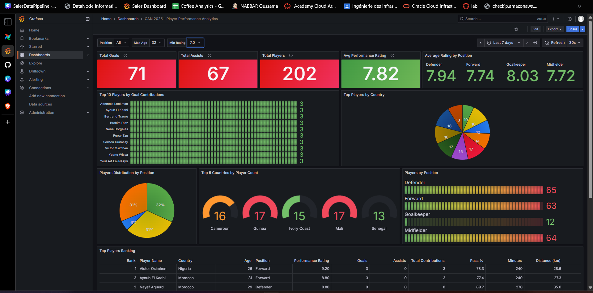
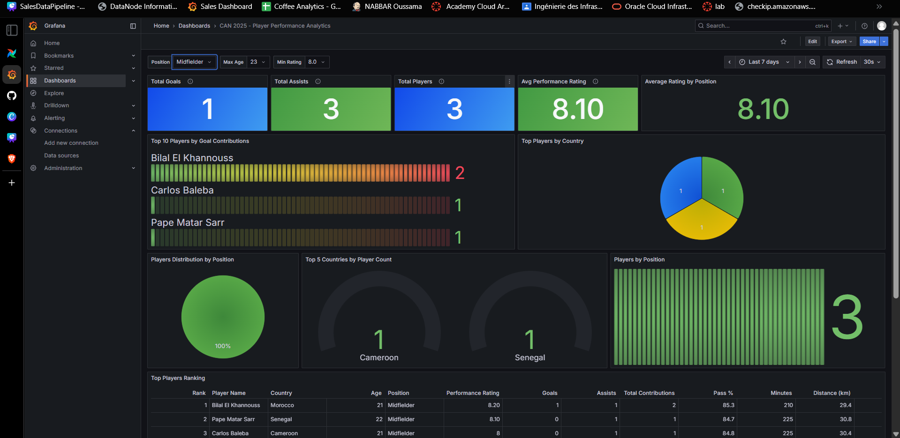
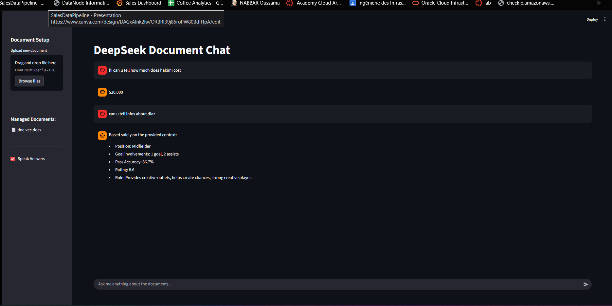

# SBI CAN2025 Data Pipeline Challenge

  

> **Analyzing football stats with data engineering.**

## Project Overview
This project builds a full data pipeline for the **SBI CAN 2025 Challenge** to process and visualize AFCON player stats. It moves data from raw CSVs to dashboards using **Kafka, Spark, gx, Airflow, and Postgres**.

---

## Orchestration with Airflow
**Apache Airflow** manages the daily/triggered runs. It ensures:
1.  Data flows into the system.
2.  Spark cleans and structures the data.
3.  Quality checks pass before data hits the warehouse.

---

## Data Visualization

### Dashboard Overview
Our **Grafana dashboard** visualizes key metrics like goals, assists, and passing accuracy.

### Filtered Analysis
Filters help users compare specific players and teams for deeper analysis.

---

## RAG Chatbot
The **Streamlit app** lets you ask questions about the data in plain English. It uses RAG to find answers from documentation and stats.

---

### Conclusion
**Using modern tools to make football data easy to understand.**
